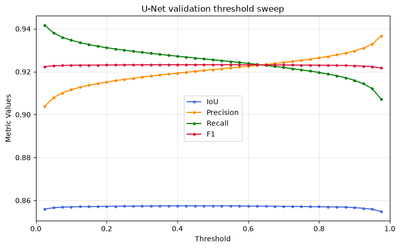
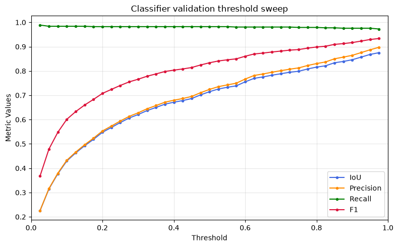

Results
=======

This page summarizes the final held-out test metrics for the raw models, the released ASTA postprocessing defaults, and the validation-selected postprocessing parameters.

Final model metrics
-------------------

.. list-table::
   :header-rows: 1

   * - Model
     - Split
     - IoU
     - Dice/F1
     - Precision
     - Recall
     - Specificity
     - FPR
     - FNR
   * - Classifier U-Net
     - Test
     - 0.8202
     - 0.9012
     - 0.8893
     - 0.9135
     - 0.9999
     - 7.02e-05
     - 0.0865
   * - Baseline U-Net
     - Test
     - 0.8131
     - 0.8969
     - 0.8801
     - 0.9144
     - 0.9999
     - 7.68e-05
     - 0.0856
   * - Classifier U-Net + selected postprocessing
     - Test
     - 0.8100
     - 0.8950
     - 0.8484
     - 0.9470
     - 0.9999
     - 1.04e-04
     - 0.0530
   * - U-Net + selected postprocessing
     - Test
     - 0.8095
     - 0.8947
     - 0.8465
     - 0.9487
     - 0.9999
     - 1.06e-04
     - 0.0513
   * - Classifier U-Net + ASTA defaults
     - Test
     - 0.7961
     - 0.8865
     - 0.8283
     - 0.9534
     - 0.9999
     - 1.22e-04
     - 0.0466
   * - U-Net + ASTA defaults
     - Test
     - 0.7914
     - 0.8836
     - 0.8231
     - 0.9537
     - 0.9999
     - 1.27e-04
     - 0.0463

Classifier-only patch metrics
-----------------------------

The patch classifier was evaluated independently on the held-out test split using the final classifier threshold ``0.725``. These metrics are patch-wise: each ``528 x 528`` patch is counted as trail-containing or background.

.. list-table::
   :header-rows: 1

   * - Split
     - Threshold
     - TP
     - FP
     - FN
     - TN
     - Accuracy
     - Precision
     - Recall
     - Dice/F1
     - IoU
     - Specificity
     - FPR
     - FNR
   * - Test
     - 0.725
     - 579
     - 122
     - 15
     - 9,684
     - 0.9868
     - 0.8260
     - 0.9747
     - 0.8942
     - 0.8087
     - 0.9876
     - 0.0124
     - 0.0253

Operating thresholds
--------------------

The final full-field evaluation used ``UNET_THRESHOLD = 0.65`` and ``CLASSIFIER_THRESHOLD = 0.725``.

The selected postprocessing configuration uses Hough threshold ``50``, minimum line length ``100``, maximum line gap ``125``, a ``3 x 3`` closing kernel, minimum component size ``500``, and contour-area threshold ``1500``. The final evaluator also runs the released ASTA defaults, whose corresponding maximum line gap and contour-area threshold are ``250`` and ``3000``.

The U-Net threshold was selected to balance precision and recall for the final full-field pipeline. The validation sweep showed a broad high-performing region, and the final threshold favors a conservative binary segmentation before optional postprocessing.

The classifier threshold was selected from the validation sweep using the same training-time ranking metric used to score the classifier: penalized specificity with a minimum-recall target. This selected ``0.725`` on the validation split.

Full-field timing
-----------------

The table below summarizes an end-to-end timing experiment. Each entry is the mean runtime in seconds, with the standard deviation in parentheses, over ten measured full-field runs after three warm-up runs. The experiment is run on an image where the classifier flags 34 of the patches as positive.

The CPU measurements were collected on a standard Colab CPU runtime using the CPU execution device, with no GPU accelerator available. The runtime provided an Intel(R) Xeon(R) CPU @ 2.20GHz with 2 CPU cores and 12.67 GB of system memory.

The GPU measurements were collected on a Colab A100 runtime using CUDA execution. The runtime provided an NVIDIA A100-SXM4-80GB accelerator with 79.25 GB of GPU memory, backed by an Intel(R) Xeon(R) CPU @ 2.20GHz host with 12 CPU cores and 167.05 GB of system memory.

.. list-table::
   :header-rows: 1

   * - Stage
     - CPU U-Net
     - CPU classifier-gated U-Net
     - A100 GPU U-Net
     - A100 GPU classifier-gated U-Net
   * - Preprocessing
     - 2.39 (0.31)
     - 2.59 (0.25)
     - 1.83 (0.01)
     - 1.86 (0.01)
   * - Data loader setup
     - 0.33 (0.04)
     - 0.40 (0.06)
     - 0.06 (0.00)
     - 0.07 (0.01)
   * - Classifier gate
     - --
     - 15.02 (1.32)
     - --
     - 0.46 (0.01)
   * - U-Net prediction
     - 108.26 (2.04)
     - 9.33 (0.18)
     - 1.36 (0.01)
     - 0.31 (0.01)
   * - Segmentation subtotal
     - 108.63 (2.04)
     - 24.78 (1.24)
     - 1.44 (0.01)
     - 0.86 (0.02)
   * - Hough postprocessing
     - 4.12 (0.34)
     - 4.06 (0.47)
     - 3.24 (0.01)
     - 3.40 (0.01)
   * - Total
     - 115.14 (2.07)
     - 31.44 (1.72)
     - 6.51 (0.02)
     - 6.12 (0.02)

The classifier-gated pipeline is substantially faster on CPU because most patches are rejected before U-Net inference. On the A100 runtime, U-Net inference is already fast and the total runtime is dominated by preprocessing and Hough postprocessing, so the classifier gives a smaller absolute gain.

Validation threshold sweeps
---------------------------

   U-Net validation metrics across probability thresholds. The final full-field evaluation used ``UNET_THRESHOLD = 0.65`` to balance precision and recall.

   Classifier validation metrics across probability thresholds. The final full-field evaluation used ``CLASSIFIER_THRESHOLD = 0.725``, selected by the classifier ranking metric used during training.
